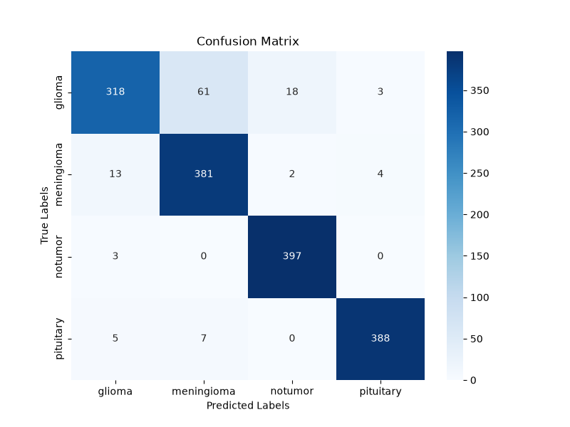
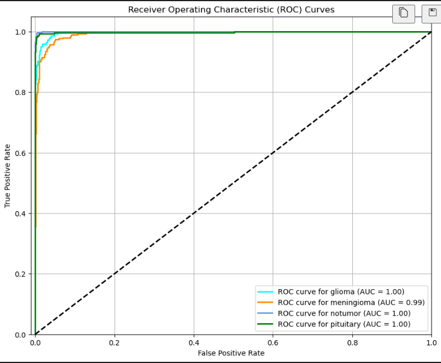

# 🧠 Brain Tumor Detection & Classification System

An end-to-end Deep Learning web application for automatic detection and multi-class classification of brain tumors from MRI scans. Built with **TensorFlow/Keras**, **Flask REST API**, and a modern **React + Vite** frontend interface.

---

## 📌 Project Overview

Brain tumor classification plays a critical role in medical diagnostics and treatment planning. This system automates the evaluation of Brain MRI scans, classifying them into 4 distinct categories:

1. **Glioma**: Primary brain tumor originating in glial cells.
2. **Meningioma**: Tumor arising from the meninges (membranes covering the brain/spinal cord).
3. **No Tumor**: Healthy brain MRI scan without detectable tumor tissue.
4. **Pituitary**: Tumor developing in the pituitary gland.

The application accepts an uploaded brain MRI image, pre-processes it to $128 \times 128$ resolution, runs inference through a trained Convolutional Neural Network (CNN), and returns the diagnosis along with confidence probability metrics.

---

## 📊 Model Performance & Evaluation Metrics

The Deep Learning model was evaluated on 1,600 test MRI samples using multiple performance metrics:

### 1. Training History (Accuracy vs. Loss)
The model was trained over 5 epochs. The training curve demonstrates rapid convergence, with accuracy reaching **~96.5%** and training loss dropping significantly from **0.47** down to **~0.09**.

.png)

### 2. Confusion Matrix
Evaluating multi-class predictions across 1,600 unseen test samples (400 per class):
* **Glioma**: 318 correct predictions out of 400 cases.
* **Meningioma**: 381 correct predictions out of 400 cases.
* **No Tumor**: 397 correct predictions out of 400 cases (*99.25% precision*).
* **Pituitary**: 388 correct predictions out of 400 cases.



### 3. Receiver Operating Characteristic (ROC) Curves
The Area Under the Curve (AUC) scores demonstrate near-perfect class separation across all 4 categories:
* **Glioma ROC AUC**: `1.00`
* **Meningioma ROC AUC**: `0.99`
* **No Tumor ROC AUC**: `1.00`
* **Pituitary ROC AUC**: `1.00`



---

## 🛠️ Project Structure

```
Brain_tumor_prediction_model/
├── .gitattributes                # Git LFS configuration for model.keras
├── .gitignore                    # Prevents datasets and heavy build files from git
├── README.md                     # Documentation & setup guide
├── model_and_api/                # Backend Flask API & Deep Learning Model
│   ├── FlaskAPI.py               # Flask REST server handling image upload & inference
│   ├── mainModel.ipynb           # Model architecture, training script, & evaluations
│   ├── model.keras               # Trained Keras model file (~128 MB)
│   ├── requirement.txt           # Python dependencies (TensorFlow, Flask, Gunicorn, etc.)
│   ├── .env.example              # Environment variables template
│   ├── confusion_matrics.png     # Evaluation plot
│   ├── ROC_curve.png             # Evaluation plot
│   ├── model_training_history(accuracy vs loss).png # Evaluation plot
│   └── uploads/                  # Temporary storage for uploaded scans
└── Mini-project-frontend/        # React + Vite Frontend UI
    ├── package.json              # NPM dependencies & scripts
    ├── index.html                # Entry point HTML
    ├── src/                      # React components & UI logic
    └── .env.example              # Frontend environment variables template
```

---

## 🚀 Detailed Local Setup & Running Guide

### Prerequisites
- **Python**: Version 3.10 or higher
- **Node.js**: Version 18.x or higher (includes `npm`)
- **Git & Git LFS**: Required if pulling or pushing the large `model.keras` file

---

### Step 1: Model & Dataset Setup (Optional for Re-training)

1. Download the Brain Tumor MRI Dataset from [Kaggle](https://www.kaggle.com/datasets/masoudnickparvar/brain-tumor-mri-dataset).
2. Unzip the downloaded dataset.
3. Move the `Training` and `Testing` folders into `model_and_api/` directory if you wish to re-train the model in `mainModel.ipynb`.
4. Run all cells in `model_and_api/mainModel.ipynb` to generate a fresh `model.keras` file.

---

### Step 2: Backend Setup (Flask API)

1. Open terminal and navigate to `model_and_api`:
   ```bash
   cd model_and_api
   ```
2. Create and activate a Python virtual environment:
   - **Windows**:
     ```cmd
     python -m venv .venv
     .venv\Scripts\activate
     ```
   - **macOS/Linux**:
     ```bash
     python3 -m venv .venv
     source .venv/bin/activate
     ```
3. Install required dependencies:
   ```bash
   pip install -r requirement.txt
   ```
4. Configure environment variables (optional):
   Create a `.env` file inside `model_and_api/` based on `.env.example`:
   ```env
   MODEL_PATH=./model.keras
   UPLOAD_DIR=./uploads
   CORS_ORIGINS=*
   PORT=5000
   ```
5. Start the Flask API server using Waitress WSGI server:
   ```bash
   python -m waitress FlaskAPI:app
   ```
   *(Alternatively, you can also run `python FlaskAPI.py`)*

   The backend API will run locally at `http://localhost:5000`. Test endpoint health at `http://localhost:5000/health`.

---

### Step 3: Frontend Setup (React + Vite)

1. Open a new terminal window and navigate to `Mini-project-frontend`:
   ```bash
   cd Mini-project-frontend
   ```
2. Install NPM packages:
   ```bash
   npm install
   ```
3. Configure environment variables:
   Create a `.env` file in `Mini-project-frontend/` based on `.env.example`:
   ```env
   VITE_API_BASE_URL=http://localhost:5000
   ```
4. Start the frontend development server:
   ```bash
   npm run dev
   ```
5. Open the displayed local URL (e.g. `http://localhost:5173`) in your web browser. Upload a brain MRI image to receive real-time prediction results!

---

## 🌐 Cloud Deployment Guide (Render)

### Step 1: Git LFS & GitHub Push
Since `model.keras` exceeds GitHub's 100MB single-file limit, use **Git LFS**:
```bash
git lfs install
git lfs track "*.keras"
git add .
git commit -m "Configure deployment and README documentation"
git push origin main
```

### Step 2: Deploy Backend Web Service on Render
1. Go to [Render Dashboard](https://dashboard.render.com/) $\rightarrow$ **New +** $\rightarrow$ **Web Service**.
2. Connect your GitHub repository.
3. Configure settings:
   - **Root Directory**: `model_and_api`
   - **Environment**: `Python 3`
   - **Build Command**: `pip install -r requirement.txt`
   - **Start Command**: `gunicorn -b 0.0.0.0:$PORT --timeout 120 FlaskAPI:app`
4. Set Environment Variables:
   - `CORS_ORIGINS`: `https://your-frontend-name.onrender.com`
5. Deploy and save the generated service URL.

### Step 3: Deploy Frontend Static Site on Render
1. Go to Render Dashboard $\rightarrow$ **New +** $\rightarrow$ **Static Site**.
2. Select your repository.
3. Configure settings:
   - **Root Directory**: `Mini-project-frontend`
   - **Build Command**: `npm install && npm run build`
   - **Publish Directory**: `dist`
4. Set Environment Variable:
   - `VITE_API_BASE_URL`: `https://your-backend-service.onrender.com`
5. Deploy the static site!
